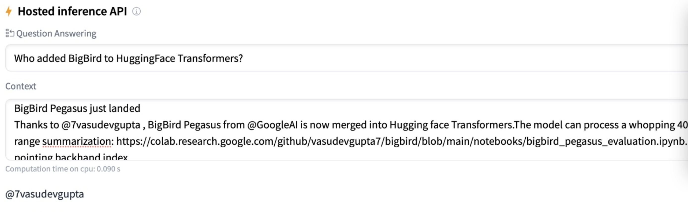

# BigBird

<p>
<a href="https://console.tiyaro.ai/explore/vasudevgupta-bigbird-roberta-natural-questions"> </a>
</p>

This repository tracks all my work related to porting [**Google's BigBird**](https://github.com/google-research/bigbird) to **🤗 Transformers**. I also trained 🤗's `BigBirdModel` & `FlaxBigBirdModel` (with suitable heads) on some of datasets mentioned in the paper: [**Big Bird: Transformers for Longer Sequences**](https://arxiv.org/abs/2007.14062). This repository hosts those scripts as well.

You can find the quick demo in 🤗spaces: https://hf.co/spaces/vasudevgupta/BIGBIRD_NATURAL_QUESTIONS

Checkout following notebooks for diving deeper into using 🤗 BigBird:

| Description   | Notebook |
|---------------|----------|
| `Flax BigBird` evaluation on natural-questions dataset | <a href="https://colab.research.google.com/github/vasudevgupta7/bigbird/blob/main/notebooks/evaluate-flax-natural-questions.ipynb" target="_parent"></a> |
| `PyTorch BigBird` evaluation on natural-questions dataset | <a href="https://colab.research.google.com/github/vasudevgupta7/bigbird/blob/main/notebooks/evaluate-torch-natural-questions.ipynb" target="_parent"></a> |
| `PyTorch BigBirdPegasus` evaluation on PubMed dataset | <a href="https://colab.research.google.com/github/vasudevgupta7/bigbird/blob/main/notebooks/bigbird_pegasus_evaluation.ipynb" target="_parent"></a> |
| How to use 🤗's BigBird (RoBERTa & Pegasus) for inference | <a href="https://colab.research.google.com/github/vasudevgupta7/bigbird/blob/main/notebooks/bigbird-inference.ipynb" target="_parent"></a> |


## Updates @ 🤗

| Description                | Dated                | Link                |
|----------------------------|----------------------|---------------------|
| Script for training `FlaxBigBird` (with QA heads) on **natural-questions** | June 25, 2021 | [PR #12233](https://github.com/huggingface/transformers/pull/12233) |
| Added **Flax/Jax** `BigBird-RoBERTa` to **🤗Transformers** | June 15, 2021  | [PR #11967](https://github.com/huggingface/transformers/pull/11967) |                                             
| Added **PyTorch** `BigBird-Pegasus` to **🤗Transformers**  | May 7, 2021    | [PR #10991](https://github.com/huggingface/transformers/pull/10991) |
| Published blog post @ **🤗Blog**                          | March 31, 2021 | [Link](https://huggingface.co/blog/big-bird)                        |
| Added **PyTorch** `BigBird-RoBERTa` to **🤗Transformers**  | March 30, 2021 | [PR #10183](https://github.com/huggingface/transformers/pull/10183) |


## Training BigBird

I have trained BigBird on [`natural-questions`](https://huggingface.co/datasets/natural_questions) dataset. This dataset takes around 100 GB of space on a disk. Before diving deeper into scripts, let's set up the system using the following commands:

```shell
# clone my repository
git clone https://github.com/vasudevgupta7/bigbird

# install requirements
cd bigbird
pip3 install -r requirements.txt

# switch to code directory
cd src

# create data directory for preparing natural questions
mkdir -p data
```

Now that your system is ready let's preprocess & prepare the dataset for training. Just run the following commands:

```shell
# this will download ~ 100 GB dataset from 🤗 Hub & prepare training data in `data/nq-training.jsonl`
PROCESS_TRAIN=true python3 prepare_natural_questions.py

# for preparing validation data in `data/nq-validation.jsonl`
PROCESS_TRAIN=false python3 prepare_natural_questions.py
```

The above commands will first download the dataset from 🤗 Hub & then will prepare it for training. Remember this will download ~ 100 GB of the dataset, so you need to have a good internet connection & enough space (~ 250 GB free space). Preparing the dataset will take ~ 3 hours.

Now that you have prepared the dataset let's start training. You have two options here:

1. Train PyTorch version of BigBird with 🤗 Trainer
2. Train FlaxBigBird with custom training loop

**PyTorch BigBird distributed training on multiple GPUs**

```
# For distributed training (using nq-training.jsonl & nq-validation.jsonl) on 2 gpus
python3 -m torch.distributed.launch --nproc_per_node=2 train_nq_torch.py
```

**Flax BigBird distributed training on TPUs/GPUs**

```shell
# start training
python3 train_nq_flax.py

# For hparams tuning, try wandb sweep (`random search` is happening by default):
wandb sweep sweep_flax.yaml
wandb agent <agent-id-created-by-above-CMD>
```

You can find my fine-tuned checkpoints on HuggingFace Hub. Refer to the following table:

| Checkpoint     |  Description     |
|----------------|------------------|
| [`flax-bigbird-natural-questions`](https://huggingface.co/vasudevgupta/flax-bigbird-natural-questions) | Obtained by running `train_nq_flax.py` script |
| [`bigbird-roberta-natural-questions`](https://huggingface.co/vasudevgupta/bigbird-roberta-natural-questions) | Obtained by running `train_nq_torch.py` script |

To see how the above checkpoint performs on the QA task, check out this: 



*Context is just a tweet taken from 🤗 Twitter Handle. 💥💥💥*
