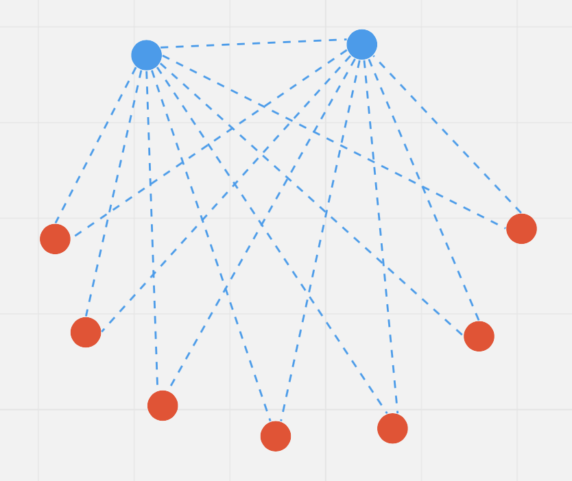
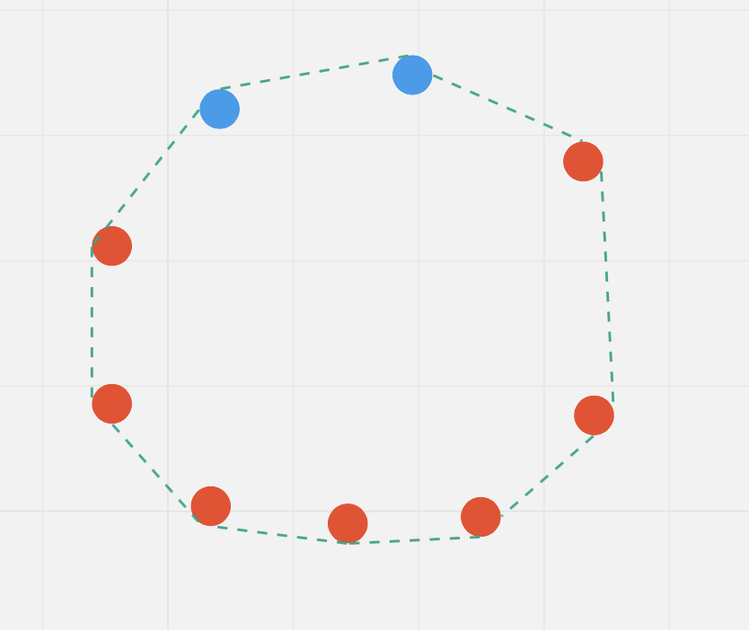
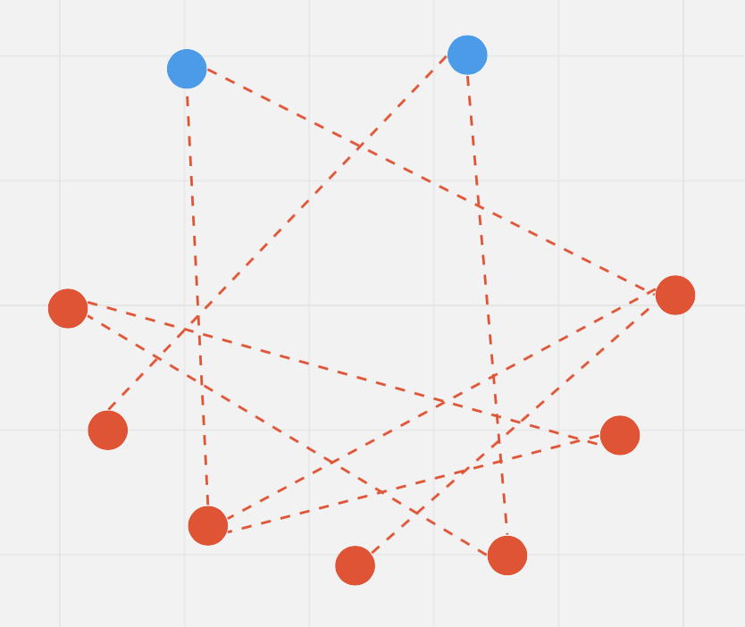
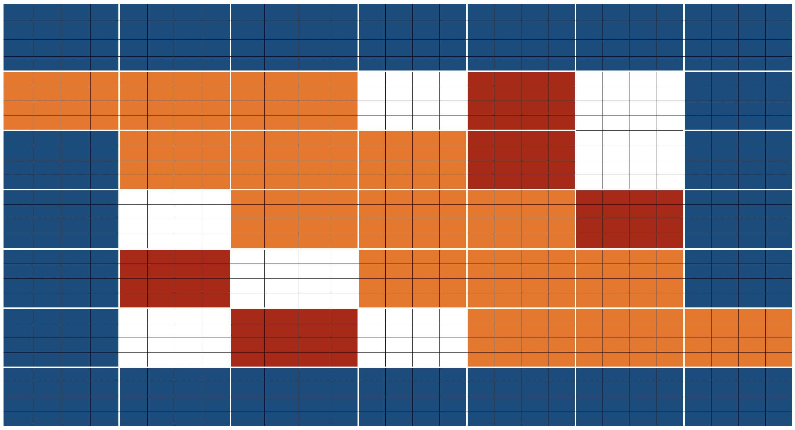

# <p align=center>`Big Bird`</p>

[WIP] Lemme finish this first ...

## Introduction

Transformer-based models have shown to be very useful for many NLP tasks. However, a major limitation of transformers-based models is it's `O(n^2)` time & memory complexity (where n is sequence length). Hence, it's computationally very expensive to apply transformer-based models on long sequences (n > 512). Several recent papers, *e.g.* `Longformer`, `Performer`, `Reformer`, `Clustered attention`, try to remedy this problem by approximating the full attention matrix. You can checkout 🤗's recent blog [post](https://huggingface.co/blog/long-range-transformers) in case you are unfamilier with these models.

`BigBird` (introduced in [paper](https://arxiv.org/abs/2007.14062)) is one of such recent models to address this issue. `BigBird` relies on **block sparse attention** instead of normal attention (*i.e.* BERT's attention) and can handle sequences up to a length of **4096** at a much lower compute cost compared to BERT. It has achieved SOTA on various tasks involving very long sequences such as long documents summarization, question-answering with long contexts.

Before going into more depth, it is important to remember that the `BigBird`s attention is an approximation of `BERT`'s full attention and is thus not **better** as `BERT's` full attention. It simply allows to apply transformer-based models to much longer sequences since BERT's quadratic memory requirement quickly becomes unbearable. Simply put, if we would have $\infty$ compute & $\infty$ time, BERT's attention is always better than block sparse attention (which we are going to discuss in this post). So, one should aim for attending to as many tokens as possible at a reasonable compute & memory cost.

If you wonder why we need more compute when working with longer sequences, (no worries!) just continue reading this post.

---

Some of the main question when working with normal `BERT`-like attention, one might have are:

* Do all the tokens really have to attend to all other tokens?
* Why not compute attention over only those tokens that are important?
* How to decide what tokens are important?

---

In this block post, we will try to answer those questions. But first, let's give some background on how attention works.

### Let's build our attention matrix

We will define an empty `set` and fill it up with the tokens which current query should attend based on some ideas & intuition.

```python
>>> # let's consider a sentence for understanding
>>> example = ['BigBird', 'is', 'now', 'available', 'in', 'HuggingFace', 'for', 'question', 'answering']

>>> # further let's assume, we're trying to understand the representation of 'available' i.e. 
>>> query_token = 'available'

>>> # We will initialize an empty `set` and fill up the tokens of our interest as we proceed in this section.
>>> key_tokens = set() # => currently 'available' token doesn't have anything to attend
```

Nearby tokens should be important because in a sentence (sequence of words), the current word is highly dependent on neighboring future & past tokens. This intuition is the idea behind the concept of `sliding attention`.

```python
>>> # considering `window_size = 3`, we will consider 1 token to left & 1 to right of 'available'
>>> # left token: 'now' ; right token: 'in'
>>> sliding_tokens = ["now", "available", "in"]

>>> # let's update our collection with the above tokens
>>> key_tokens.update(sliding_tokens)
```

**Long range dependencies:** For some tasks, it is crucial that the model is able to capture long range relationships between tokens. *E.g.*, in `question-answering` the model needs to compare each token of the context to the whole question to be able to figure out which part of the context is useful for a correct answer. If most of the context tokens would just attend to other context tokens, but not to the question, it becomes much harder for the model to filter important context tokens from less important context tokens.

Now, `BigBird` proposes two ways of allowing long-term attention dependencies while staying computationally efficient.

* Introduce some tokens which will attend to every token and which are attented by every token. Eg: "HuggingFace is building nice libraries for easy NLP". Now, let's say 'building' is defined as a global token, and we want to associate 'NLP' with 'HuggingFace' for some task; Now having 'building' attend globally to all other tokens will probably help the model to assiciate 'NLP' with 'HuggingFace'.

```python
>>> # let's assume 1st & last token to be `global`, then
>>> global_tokens = ["BigBird", "answering"]

>>> # fill up global tokens in our key tokens collection
>>> key_tokens.update(global_tokens)
```

* Introduce some random tokens which will transfer information by transfering to other tokens which in turn can transfer to other tokens. This may reduce the cost of information travel from one token to other.

```python
>>> # now we can choose `r` token randomly from our example sentence
>>> # let's choose 'question', 'is' assuming `r=1`
>>> random_tokens = ["is"]

>>> # fill random tokens to our collection
>>> key_tokens.update(random_tokens)

>>> # it's time to see what all tokens get's into our `key_tokens`
>>> key_tokens
{'now', 'is', 'in', 'answering', 'available', 'BigBird'}

# Now, 'available' (query we choose in our 1st step) will attend only these tokens instead of attending the complete sequence
```

This way, we just need our query token to attend a subsequence & possibly it will represent all the tokens nicely. The same approach will be used for all other tokens.
But remember, the idea here is to approximate `BERT`'s full attention as efficiently as possible. This is when `BigBird`'s block sparse attention comes into the picture.

### Understanding Big Bird's attention with Graphs

Let's try to understand the need of `global`, `sliding` & `random` attention using graphs.

 </img>
 </img>
 </img> <br>

*The above figure shows `global` (left), `sliding` (middle) & `random` (right) connections respectively as a graph. Each node corresponds to a token and each dotted-line represents attention score. If no connection is made between 2 tokens, then attention score is assumed to 0.*

BigBird block sparse attention is simply combination of these 3 figures. While in normal attention, all 36 connections (note: total 9 nodes are present) would have been present in above figure. You can simply think of normal attention as all the tokens attending globally.

| Attention Type  | `global_tokens`   | `sliding_tokens` | `random_tokens`                    |
|-----------------|-------------------|------------------|------------------------------------|
| `original_full` | `n`               | 0                | 0                                  |
| `block_sparse`  | 2 x `block_size`  | 3 x `block_size` | `num_random_blocks` x `block_size` |

*`original_full` represents `BERT`'s attention while `block_sparse` represents `BigBird`'s attention. Wondering what the `block_size` is? We will cover that in later sections. For now consider it to be 1.*

**Normal attention:** Model can transfer information from one token to another token directly in a single layer, since each token is queried over every other token and information can flow among all tokens in a single layer.

**Block sparse attention:** If we want to share information between two nodes (or tokens), we may need to travel across various other nodes in the path; since all the nodes are not directly connected in a single layer. Hence, we may need multiple layers to capture the entire information of the sequence; which normal attention can capture in a single layer. This can amount to a time complexity of `O(n^2)` because now we need as many layers as sequence length.

## Big Bird block sparse attention

BigBird block sparse attention is just an efficient implementation of what we discussed above. Each token is attending some **global tokens**, **sliding tokens**, & **random tokens** instead of attending to **all** other tokens. The authors hardcoded the attention matrix for each component; and used a cool trick to speed up training/inference process on gpu/tpu. You can `sliding_attention` section.


*Note: on the top, we have 2 extra sentences. As you can notice, every token is just switched by one place in both sentence. This is how sliding attention is implemented. When `q[i]` is multiplied with `k[i,0:3]`, we will get a sliding attention score for `q[i]` (where `i` is index of element in sequence).*

You can find the actual implementation of `block_sparse` attention [here](https://github.com/vasudevgupta7/transformers/blob/5f2d6a0c93ca2017961199aa04a344b9b779d454/src/transformers/models/big_bird/modeling_big_bird.py#L513). Hhis may look very scary 😨😨 now. But this article will surely ease your life in understanding the code.

### Global Attention

For global attention, each query is simply attending to all the other tokens in the sequence & is attended by every other token. Let's assume `Vasudev` (1st token) & `them` (last token) to be global (in above figure). You can see that these tokens are direcctly connected to all other tokens (blue boxes).

```python
# pseudo code

# 1st & last token attends all other tokens
Q[0] x (K[0], K[1], K[2], ......, K[n-1])
Q[n-1] x (K[0], K[1], K[2], ......, K[n-1])

# 1st & last token getting attended by all other tokens
K[0] x (Q[0], Q[1], Q[2], ......, Q[n-1])
K[n-1] x (Q[0], Q[1], Q[2], ......, Q[n-1])
```

### Sliding Attention

Key sequence is copied 2 times with each element shifted to right in one of the copy and to the left in the other copy. Now if we multiply query sequence vectors by these 3 sequences vectors, we will cover all the sliding tokens. Compute capacity of that
will be only `O(3xn)` or simpy `O(n)`. Referring to the above picture, the green boxes represents sliding attention. You can see 3 sequences in the top of figure with 2 of them shifted by one token (1 to the left, 1 to the right).

```python
# what we want to do
Q[i] x (K[i-1], K[i], K[i+1])

# efficient implementation in code (assume dot product multiplication 👇)
(Q[0], Q[1], Q[2], ......, Q[n-2], Q[n-1]) x (K[1], K[2], K[3], ......, K[n-1], K[0])
(Q[0], Q[1], Q[2], ......, Q[n-1]) x (K[n-1], K[0], K[1], ......, K[n-2])
(Q[0], Q[1], Q[2], ......, Q[n-1]) x (K[0], K[1], K[2], ......, K[n-1])

# Each sequence is getting mutiplied by only 3 sequences to keep `window_size = 3`.
```

### Random Attention

Random attention is ensuring that each query token will attend a few random tokens as well. For the actual implementation, this means that the model simply
gathers some tokens randomly and computes their attention score.

```python
# r1, r2, r are some random indices; Note: r1, r2, r3 are different for each row 👇
Q[0] x (Q[r1], Q[r2], ......, Q[r])
Q[1] x (Q[r1], Q[r2], ......, Q[r])
.
.
.
Q[n-1] x (Q[r1], Q[r2], ......, Q[r])
```

**Note:** The current implementation further divides sequence into blocks & each notation is defined w.r.to block instead of token. Hence, `BigBird` as implemented in HuggingFace is currently using the 1st block & last block as global tokens.

### Normal sparse vs Block sparse

TODO

## Time & Memory complexity

| Attention Type  | Sequence length | Time & Memory Complexity |
|-----------------|-----------------|--------------------------|
| `original_full` | 512             | `M`                      |
|                 | 1024            | 4 x `M`                  |
|                 | 4096            | 64 x `M`                 |
| `block_sparse`  | 1024            | 2 x `M`                  |
|                 | 4096            | 8 x `M`                  |

*In this table, I am trying to compare time & space complexity of BERT attention and BigBird block sparse attention.*

<details>

<summary>Expand this snippet in case you wanna see the calculations</summary>

```md
BigBird time complexity = O(w x n + r x n + g x n)
BERT time complexity = O(n^2)

Assumptions:
    w = 3 x 64
    r = 3 x 64
    g = 2 x 64

When seqlen = 512
=> **time complexity in BERT = 512^2**

When seqlen = 1024
=> time complexity in BERT = (2 x 512)^2
=> **time complexity in BERT = 4 x 512^2**

=> time complexity in BigBird = (8 x 64) x (2 x 512)
=> **time complexity in BigBird = 2 x 512^2**

When seqlen = 4096
=> time complexity in BERT = (8 x 512)^2
=> **time complexity in BERT = 64 x 512^2**

=> compute in BigBird = (8 x 64) x (8 x 512)
=> compute in BigBird = 8 x (512 x 512)
=> **time complexity in BigBird = 8 x 512^2**
```

</details>

## ITC vs ETC

BigBird model is finetuned using 2 different strategies: **ITC** & **ETC**. ITC (internal transformer construction) is simply what we discussed above. While in ETC (extended transformer construction), some extra tokens are made global such that they will attend / will be attented by all tokens.

ITC requires less compute since very few tokens are globals & model can still capture global information with them. On the other hand, ETC can be very helpful for the tasks in which we need lot of global tokens such as `question-answering` in which entire question should be global, with many tokens of context to be able to understand context; `summarization` since model needs to understand the overall context of very long paragraph.

The table below summarizes ITC & ETC:

|                                              | ITC                                   | ETC                                  |
|----------------------------------------------|---------------------------------------|--------------------------------------|
| Attention Matrix with global attention       |<a href="https://www.codecogs.com/eqnedit.php?latex=A&space;=&space;\begin{bmatrix}&space;1&space;&&space;1&space;&&space;1&space;&&space;1&space;&&space;1&space;&&space;1&space;&&space;1&space;\\&space;1&space;&&space;&&space;&&space;&&space;&&space;&&space;1&space;\\&space;1&space;&&space;&&space;&&space;&&space;&&space;&&space;1&space;\\&space;1&space;&&space;&&space;&&space;&&space;&&space;&&space;1&space;\\&space;1&space;&&space;&&space;&&space;&&space;&&space;&&space;1&space;\\&space;1&space;&&space;&&space;&&space;&&space;&&space;&&space;1&space;\\&space;1&space;&&space;1&space;&&space;1&space;&&space;1&space;&&space;1&space;&&space;1&space;&&space;1&space;\end{bmatrix}" target="_blank"></a> | <a href="https://www.codecogs.com/eqnedit.php?latex=B&space;=&space;\begin{bmatrix}&space;1&space;&&space;1&space;&&space;1&space;&&space;1&space;&&space;1&space;&&space;1&space;&&space;1&space;&&space;1&space;&&space;1&space;\\&space;1&space;&&space;1&space;&&space;1&space;&&space;1&space;&&space;1&space;&&space;1&space;&&space;1&space;&&space;1&space;&&space;1&space;\\&space;1&space;&&space;1&space;&&space;1&space;&&space;1&space;&&space;1&space;&&space;1&space;&&space;1&space;&&space;1&space;&&space;1&space;\\&space;1&space;&&space;1&space;&&space;1&space;&&space;&&space;&&space;&&space;&&space;&&space;1&space;\\&space;1&space;&&space;1&space;&&space;1&space;&&space;&&space;&&space;&&space;&&space;&&space;1&space;\\&space;1&space;&&space;1&space;&&space;1&space;&&space;&&space;&&space;&&space;&&space;&&space;1&space;\\&space;1&space;&&space;1&space;&&space;1&space;&&space;&&space;&&space;&&space;&&space;&&space;1&space;\\&space;1&space;&&space;1&space;&&space;1&space;&&space;&&space;&&space;&&space;&&space;&&space;1&space;\\&space;1&space;&&space;1&space;&&space;1&space;&&space;1&space;&&space;1&space;&&space;1&space;&&space;1&space;&&space;1&space;&&space;1&space;\end{bmatrix}" target="_blank"></a> |
| `global_tokens`   | 2 x `block_size`                      | `extra_tokens` + 2 x `block_size`     |
| `random_tokens`   | `num_random_blocks` x `block_size`    | `num_random_blocks` x `block_size`    |
| `sliding_tokens`  | 3 x `block_size`                      | 3 x `block_size`                      |

## Using BigBird with Hugging Face transformers

You can use `BigBirdModel` just like any other HuggingFace model. Let's see some code below:

```python
from transformers import BigBirdModel

# loading bigbird from its pretrained checkpoint
model = BigBirdModel.from_pretrained("google/bigbird-roberta-base")
# This will init the model with default configuration i.e. attention_type = "block_sparse" num_random_blocks = 3, block_size = 64.
# But You can freely change these arguments with any checkpoint. These 3 argument will just change the number of tokens each query token is going to attend.
model = BigBirdModel.from_pretrained("google/bigbird-roberta-base", num_random_blocks=2, block_size=16)

# By setting attention_type to `original_full`, BigBird will be relying on full attention of n^2 complexity. This way BigBird is 99.9 % similar to BERT.
model = BigBirdModel.from_pretrained("google/bigbird-roberta-base", attention_type="original_full")
```

There are total 3 checkpoints available in huggingface_hub (at the point of writing this article): [`bigbird-roberta-base`](https://huggingface.co/google/bigbird-roberta-base), [`bigbird-roberta-large`](https://huggingface.co/google/bigbird-roberta-large), [`bigbird-base-trivia-itc`](https://huggingface.co/google/bigbird-base-trivia-itc). The first two checkpoints come from pretraining `BigBirdForPretraining` with `masked_lm loss`; while the last one corresponds to the checkpoint after finetuning `BigBirdForQuestionAnswering` on `trivia-qa` dataset.

It's important to keep the following points in mind while working with big bird:

* Sequence length must be a multiple of block size i.e. `seqlen % block_size = 0`. You need not worry since 🤗 implementation will automatically `[PAD]` (to smallest multiple of block size which is greater than sequence length) if batch sequence length is not a multiple of `block_size`.
* Current implementation doesn't support `num_random_blocks = 0`.
* Currently, HuggingFace version **doesn't support ETC** and hence only 1st & last block will be global.
* When using big bird as decoder (or using `BigBirdForCasualLM`), `attention_type` should be `original_full`. But you need not worry, 🤗 implementation will automatically switch `attention_type` to `original_full` incase you forget to do that.

## What's next?

[@patrickvonplaten](https://github.com/patrickvonplaten) has made a really cool [notebook](https://colab.research.google.com/drive/1BAraNpl98loPKG3NvdjJuCLCfvNOZO28) on how to evaluate `BigBirdForQuestionAnswering` on `trivia-qa` dataset. Feel free to play with big bird using that notebook.

You will soon see `BigBirdPegasus` in the library and will be able to do easily perform **long document summarization**💥.

## End Notes

The original implementation of **block sparse attention matrix** can be found [here](https://github.com/google-research/bigbird/blob/master/bigbird/core/attention.py). You can find 🤗 version [here](https://github.com/huggingface/transformers/pull/10183).

**Feel free to raise an issue, incase you found something wrong here. Star 🌟 this repo if you found this helpful.**
